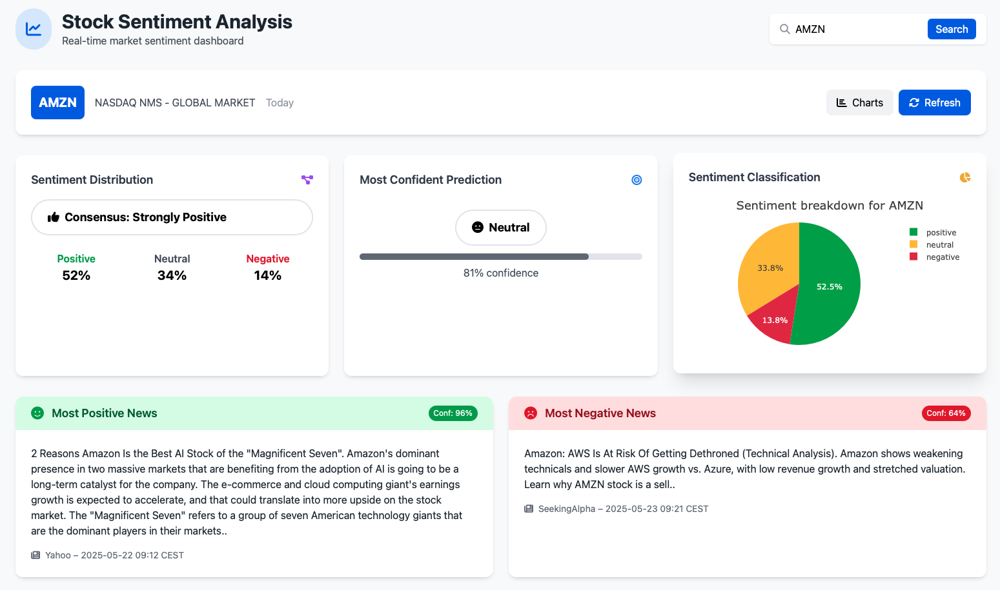

# Market Sentiment Dashboard
A real-time dashboard for analyzing sentiment in financial news articles related to publicly traded companies.
Built with **FastAPI** (backend NLP API) and **Dash** (frontend). Deployed via Docker Compose.

---

## 🔍 Features
- NLP-based sentiment analysis (positive, neutral, negative)
- Highlights most confident and most polarized news articles
- Real-time dashboard interface (Dash)
- REST API with FastAPI

---

## ⚙️ Stack
- **Python** (FastAPI, Dash, transformers)
- **Docker Compose** (2 services: `api` and `dashboard`)
- **News ingestion** via API (Finnhub)

---

## 🚀 Quickstart (Development)

### 1. Clone the repository
```bash
git clone https://github.com/LouisSch/Market-Sentiment.git
```

### 2. Create a `.env` file
```
FINNHUB_API_KEY=your_api_key_here
```

### 3. Launch the services
```bash
docker-compose up --build
```

- The API will be available at: `http://localhost:5002`
- The dashboard will be available at: `http://localhost:8050`

> ⚠️ This setup uses local volumes for live editing (development mode). For production, use `COPY` in Dockerfiles and avoid volume mounting.

---

## 🖼️ Preview


---

## 🧠 Motivation
This project was built to visualize and explore the dominant sentiment around equities based on media coverage. While not predictive, the tool offers insights into the perception dynamics that may influence markets.

---

## 🔗 Links
- 🌐 Personal Website: [https://lschirra.dev](https://lschirra.dev)

---

## 📎 License
MIT License
